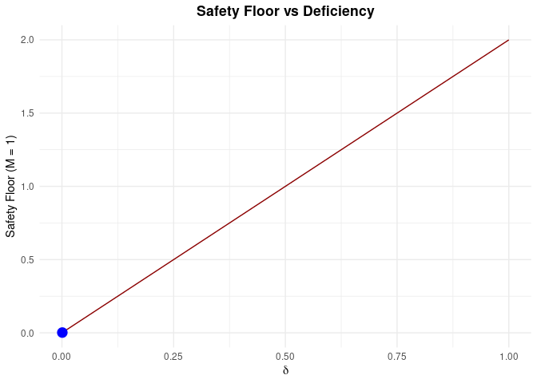

<!-- README.md is generated from README.Rmd. Please edit that file -->

# causaldef: Decision-Theoretic Causal Diagnostics

<!-- badges: start -->

[](https://lifecycle.r-lib.org/articles/stages.html#experimental)
<!-- badges: end -->

**causaldef** implements Le Cam deficiency theory for causal inference,
providing quantitative bounds on information loss from confounding,
selection bias, and distributional shift.

Unlike traditional sensitivity analysis which focuses on “how much bias”
exists, `causaldef` answers the decision-theoretic question: **“how much
regret”** might we incur by acting on this evidence?

## Installation

You can install the development version of causaldef from
[GitHub](https://github.com/) with:

``` r
# install.packages("devtools")
devtools::install_github("denizakdemir/causaldef")
```

## Core Features

  - **Deficiency Estimation**: Quantify the distance \(\delta\) between
    your observational data and the ideal interventional experiment.
  - **Policy Regret Bounds**: Compute the “safety floor” - the minimum
    unavoidable regret due to confounding.
  - **Negative Control Diagnostics**: Formal hypothesis tests for causal
    assumptions using auxiliary outcomes.
  - **Confounding Frontiers**: Visualize the boundary between identified
    and unidentified regions.
  - **Survival Analysis**: Support for time-to-event outcomes (RMST,
    Hazard Ratios).

## Example 1: Basic Deficiency Estimation

``` r
library(causaldef)
set.seed(42)

# Simulate confounded data (W satisfies back-door criterion)
n <- 500
W <- rnorm(n)
A <- rbinom(n, 1, plogis(0.5 * W))
Y <- 1 + 2 * A + W + rnorm(n)
df <- data.frame(W = W, A = A, Y = Y)

# 1. Define the causal problem
spec <- causal_spec(
  data = df,
  treatment = "A",
  outcome = "Y",
  covariates = "W"
)
#> ✔ Created causal specification: n=500, 1 covariate(s)

# 2. Estimate Le Cam deficiency for different strategies
results <- estimate_deficiency(
  spec, 
  methods = c("unadjusted", "iptw", "aipw"),
  n_boot = 100
)
#> ℹ Estimating deficiency: unadjusted
#> ℹ Estimating deficiency: iptw
#> ℹ Estimating deficiency: aipw

print(results)
#> 
#> -- Le Cam Deficiency Estimates ----------------------------------------
#> 
#>      Method  Delta     SE               CI
#>  unadjusted 0.2531 0.0460 [0.1779, 0.3452]
#>        iptw 0.0011 0.0061  [1e-04, 0.0211]
#>        aipw 0.0009 0.0029  [2e-04, 0.0108]
#> 
#> Best method: aipw (delta = 9e-04 )
```

## Example 2: Policy Regret Bounds

If we use this evidence to make a policy decision (e.g., approve a
drug), what is the worst-case loss?

``` r
# Calculate bounds for a utility range of [0, 1]
bounds <- policy_regret_bound(results, utility_range = c(0, 1))
#> ℹ Safety floor: 0.0018 (minimum regret given delta = 9e-04)

print(bounds)
#> 
#> -- Policy Regret Bound (Theorem 3.2) -----------------------------------
#> 
#> * Deficiency delta: 9e-04 
#> * Utility range: [0, 1]
#> * Safety floor: 0.0018 (minimum regret given delta)
#> 
#> Interpretation: Worst-case regret is 0.2 % of utility range due to confounding
plot(bounds, type = "safety_curve")
#> Warning: Ignoring unknown parameters: linewidth
```



## Example 3: Negative Control Diagnostic

Check if the “Adjusted” strategy actually removes confounding using a
negative control outcome \(Y_{nc}\) (known to be unaffected by
treatment).

``` r
# Add a negative control to simulation
df$Y_nc <- W + rnorm(n) # Correlated with W (confounder) but not A

spec_nc <- causal_spec(
  data = df, 
  treatment = "A", 
  outcome = "Y",
  covariates = "W",
  negative_control = "Y_nc"
)
#> ✔ Created causal specification: n=500, 1 covariate(s)

# Run diagnostic
nc_test <- nc_diagnostic(spec_nc, method = "iptw")
#> ℹ Using kappa = 1 (conservative). Consider domain-specific estimation.
#> ✔ No evidence against causal assumptions (p = 0.85072 )
print(nc_test)
#> 
#> -- Negative Control Diagnostic ----------------------------------------
#> 
#> * delta_NC (observable): 0.0089 
#> * delta bound (Theorem 5.2): 0.0089 (kappa = 1 )
#> * p-value: 0.85072 
#> 
#> NOT FALSIFIED: No evidence against causal assumptions
```

## Theory

Based on Akdemir (2026), [“Constraints on Causal Inference as Experiment
Comparison”](https://doi.org/10.5281/zenodo.18367347).

The core theorem links the deficiency \(\delta\) to the max-min
regret:

\[ \text{Regret}_{do}(\pi) \leq \text{Regret}_{obs}(\pi) + 2M \cdot \delta \]

Where \(M\) is the range of the utility function. This provides a
rigorous justification for using observational evidence in high-stakes
decision making, provided \(\delta\) is small.
