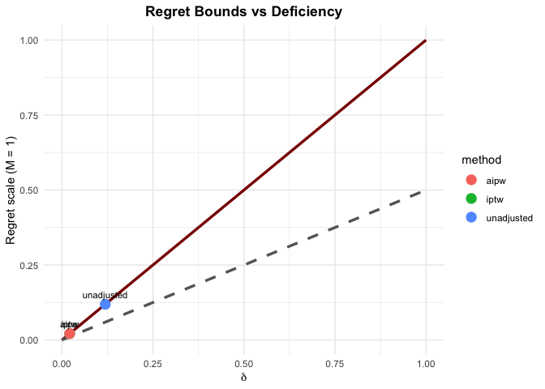

<!-- README.md is generated from README.Rmd. Please edit that file -->

# causaldef

<!-- badges: start -->

[](https://lifecycle.r-lib.org/articles/stages.html#experimental)
[](https://CRAN.R-project.org/package=causaldef)
<!-- badges: end -->

**causaldef** implements Le Cam deficiency theory for causal inference,
providing quantitative bounds on information loss from confounding,
selection bias, and distributional shift.

Unlike traditional sensitivity analysis which focuses on “how much bias”
exists, `causaldef` answers the decision-theoretic question: **“how much
regret”** might we incur by acting on this evidence?

## Key Concept: Deficiency (δ)

The **deficiency** δ is a theoretical measure of the information gap
between your observational data and a perfect randomized trial. In
practice, `causaldef` provides a **computable proxy**
 based on propensity-score TV balance (PS-TV),
which is informative about overlap/positivity and residual confounding
risk.

For bounded utilities with range
 (max minus min), the manuscript provides:

  - a **regret transfer penalty** (upper bound term) of , and
  - a minimax **safety floor** (lower bound) of \\cdot \\delta").

`policy_regret_bound()` reports both quantities.

## Scientific Contract

`causaldef` is theory-forward, but not every exported quantity is the
same kind of object. The package distinguishes:

  - **Theorem-backed quantities**: closed-form or theorem-aligned
    utilities such as `policy_regret_bound()`,
    `policy_regret_bound_vc()`, `confounding_frontier()`,
    `sharp_lower_bound()`, and `wasserstein_deficiency_gaussian()`
  - **Computable deficiency proxies**: `estimate_deficiency()` currently
    returns a PS-TV proxy, not a generic nonparametric estimator of the
    exact Le Cam deficiency
  - **Sensitivity diagnostics**: `nc_diagnostic()` combines an
    observable residual-association diagnostic with a user-supplied
    alignment parameter `kappa`
  - **Experimental heuristics**: some specialized modules expose effect
    estimates together with heuristic proxy scores; those help with
    exploration, but they should not be read as exact deficiency
    estimators unless stated explicitly

## Installation

You can install the development version of causaldef from
[GitHub](https://github.com/) with:

``` r
# install.packages("devtools")
devtools::install_github("denizakdemir/causaldef")
```

## Core Features

  - **Deficiency proxies:** `estimate_deficiency()` (PS-TV
    overlap/balance proxy)
  - **Policy regret bounds:** `policy_regret_bound()` (transfer penalty
    + minimax floor)
  - **Negative control diagnostics:** `nc_diagnostic()` (falsification
    and bounds)
  - **Sensitivity analysis:** `confounding_frontier()` (linear-Gaussian
    confounding frontier)
  - **Survival + competing risks:** `causal_spec_survival()`,
    `causal_spec_competing()`

## Example 1: Basic Deficiency Estimation

``` r
library(causaldef)
set.seed(42)

# Simulate confounded data (W satisfies back-door criterion)
n <- 500
W <- rnorm(n)
A <- rbinom(n, 1, plogis(0.5 * W))
Y <- 1 + 2 * A + W + rnorm(n)
df <- data.frame(W = W, A = A, Y = Y)

# 1. Define the causal problem
spec <- causal_spec(
  data = df,
  treatment = "A",
  outcome = "Y",
  covariates = "W"
)
#> ✔ Created causal specification: n=500, 1 covariate(s)

# 2. Estimate a deficiency proxy (PS-TV) for different strategies
results <- estimate_deficiency(
  spec, 
  methods = c("unadjusted", "iptw", "aipw"),
  n_boot = 100
)
#> ℹ Estimating deficiency: unadjusted
#> ℹ Estimating deficiency: iptw
#> ℹ Estimating deficiency: aipw

print(results)
#> 
#> -- Deficiency Proxy Estimates (PS-TV) ------
#> 
#>      Method  Delta     SE               CI            Quality
#>  unadjusted 0.1190 0.0230 [0.1048, 0.1982] Insufficient (Red)
#>        iptw 0.0212 0.0099 [0.0142, 0.0537]  Excellent (Green)
#>        aipw 0.0212 0.0087 [0.0154, 0.0483]  Excellent (Green)
#> Note: delta is a propensity-score TV proxy (overlap/balance diagnostic).
#> 
#> Best method: iptw (delta = 0.0212 )
```

**Interpretation:** Unadjusted  0.119; after IPTW/AIPW,
 0.021.

## Example 2: Policy Regret Bounds

If we use this evidence to make a policy decision (e.g., approve a
drug), what is the worst-case loss?

``` r
# Calculate bounds for a utility range of [0, 1]
bounds <- policy_regret_bound(results, utility_range = c(0, 1), method = "aipw")
#> ℹ Transfer penalty: 0.0212 (delta = 0.0212)

print(bounds)
#> 
#> -- Policy Regret Bounds -------------------------------------------------
#> 
#> * Deficiency delta: 0.0212 
#> * Delta mode: point 
#> * Delta method: aipw 
#> * Delta selection: pre-specified method 
#> * Utility range: [0, 1]
#> * Transfer penalty: 0.0212 (additive regret upper bound)
#> * Minimax floor: 0.0106 (worst-case lower bound)
#> 
#> Note: this is a plug-in bound using a deficiency proxy rather than an identified exact deficiency.
#> 
#> Interpretation: Transfer penalty is 2.1 % of utility range given delta
plot(bounds, type = "safety_curve")
```



The plug-in transfer penalty is 0.0212 on a 0–1 utility scale; the
minimax safety floor is 0.0106.

## Example 3: Negative Control Diagnostic

Check if the “Adjusted” strategy actually removes confounding using a
negative control outcome
 (known to be unaffected by treatment).

``` r
# Add a negative control to simulation
df$Y_nc <- W + rnorm(n) # Correlated with W (confounder) but not A

spec_nc <- causal_spec(
  data = df, 
  treatment = "A", 
  outcome = "Y",
  covariates = "W",
  negative_control = "Y_nc"
)
#> ✔ Created causal specification: n=500, 1 covariate(s)

# Run diagnostic
set.seed(123)
nc_test <- nc_diagnostic(spec_nc, method = "iptw")
#> ℹ Using kappa = 1 (conservative). Consider domain-specific estimation or sensitivity analysis via kappa_range.
#> ✔ No evidence against causal assumptions (p = 0.91045 )
print(nc_test)
#> 
#> -- Negative Control Diagnostic ----------------------------------------
#> 
#> * screening statistic (weighted corr): 0.0089 
#> * delta_NC (association proxy): 0.0089 
#> * delta bound (under kappa alignment): 0.0089 (kappa = 1 )
#> * screening p-value: 0.91045 
#> * screening method: weighted_permutation_correlation 
#> 
#> RESULT: NOT REJECTED. This is a screening result, not proof that confounding is absent.
#> NOTE: Your effect estimate must exceed the Noise Floor (delta_bound) to be meaningful.
```

Here, the screen does not reject (p = 0.91), but that is not proof that
confounding is absent; the observable proxy is
 0.009.

## Example 4: Survival Analysis (HCT)

``` r
data(hct_outcomes)

# Create an explicit 0/1 event indicator for death
hct <- hct_outcomes
hct$event_death <- as.integer(as.character(hct$event_status) == "Death")

spec_surv <- causal_spec_survival(
  data = hct,
  treatment = "conditioning_intensity",
  time = "time_to_event",
  event = "event_death",
  covariates = c("age", "disease_status", "kps", "donor_type"),
  estimand = "RMST",
  horizon = 24
)
#> ✔ Created survival causal specification: n=800, 131 events

def_surv <- estimate_deficiency(spec_surv, methods = c("unadjusted", "iptw"), n_boot = 50)
#> ℹ Inferred treatment value: Reduced
#> ℹ Estimating deficiency: unadjusted
#> ℹ Estimating deficiency: iptw
print(def_surv)
#> 
#> -- Deficiency Proxy Estimates (PS-TV) ------
#> 
#>      Method  Delta     SE               CI            Quality
#>  unadjusted 0.3030 0.0460 [0.2505, 0.4189] Insufficient (Red)
#>        iptw 0.0644 0.0219  [0.0498, 0.136]   Caution (Yellow)
#> Note: delta is a propensity-score TV proxy (overlap/balance diagnostic).
#> 
#> Best method: iptw (delta = 0.0644 )

bounds_surv <- policy_regret_bound(def_surv, utility_range = c(0, 24), method = "iptw")
#> ℹ Transfer penalty: 1.5457 (delta = 0.0644)
print(bounds_surv)
#> 
#> -- Policy Regret Bounds -------------------------------------------------
#> 
#> * Deficiency delta: 0.0644 
#> * Delta mode: point 
#> * Delta method: iptw 
#> * Delta selection: pre-specified method 
#> * Utility range: [0, 24]
#> * Transfer penalty: 1.5457 (additive regret upper bound)
#> * Minimax floor: 0.7728 (worst-case lower bound)
#> 
#> Note: this is a plug-in bound using a deficiency proxy rather than an identified exact deficiency.
#> 
#> Interpretation: Transfer penalty is 6.4 % of utility range given delta
```

In this death-endpoint survival example, IPTW reduces the PS-TV proxy
from about 0.303 to about 0.064, yielding a transfer penalty of about
1.55 months and a minimax floor of about 0.77 months on the 0–24 month
scale. For full relapse-versus-death analyses, use
`causal_spec_competing()` and `estimate_deficiency_competing()`.

## Theory

Based on Akdemir (2026), [“Constraints on Causal Inference as Experiment
Comparison”](https://doi.org/10.5281/zenodo.18367347).

The core theorem links the deficiency
 (Total Variation distance) to the max-min regret:

  
 \\leq \\text{Regret}_{obs}(\\pi) + M \\cdot \\delta ")  

Where
 is the range of the utility function. In practice, the package
often provides plug-in bounds by feeding a computable proxy/estimate
(e.g.,
) into the regret formula, so the interpretation
should track the underlying quantity being supplied.

## Citation

``` bibtex
@misc{causaldef,
  title = {causaldef: Decision-Theoretic Causal Diagnostics via Le Cam Deficiency},
  author = {Akdemir, Deniz},
  year = {2026},
  doi = {10.5281/zenodo.18367347}
}
```
